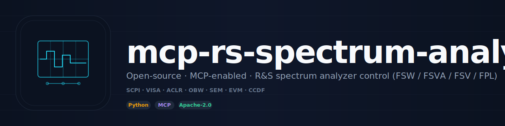

<div align="center">



<br/>

[](https://github.com/RFingAdam/mcp-rs-spectrum-analyzer/actions/workflows/ci.yml)
[](LICENSE)
[](https://www.python.org/downloads/)
[](https://modelcontextprotocol.io)
[](https://github.com/RFingAdam/eng-mcp-suite)

**Drive Rohde & Schwarz spectrum and signal analyzers from any MCP-compatible AI client.**
**TCP or VISA — 62 tools spanning frequency, bandwidth, markers, measurements (ACLR / OBW / SEM / EVM / CCDF), traces, limits, and templates.**

[Quick start](#quick-start) ·
[Tools](#tools) ·
[Workflows](#workflows) ·
[Documentation](#documentation)

</div>

---

## What is mcp-rs-spectrum-analyzer?

`mcp-rs-spectrum-analyzer` is a [Model Context Protocol](https://modelcontextprotocol.io)
server that automates spectrum and signal analyzers over SCPI. Connect any
MCP-compatible AI assistant (Claude Desktop, Claude Code, VS Code Copilot, …)
to your test equipment for hands-free RF measurements, EMC pre-compliance
testing, and automated test sequences.

Primary target is the **R&S FSW / FSVA3000 / FSV3000 / FPL1000** family
(vendor-specific result parsing, family detection). A common SCPI core also
covers Keysight (N90x0/UXA/PXA/MXA/EXA/CXA), Rigol (DSA800/RSA5000/RSA3000),
Siglent (SSA3000X/SVA1000X), Anritsu (MS2760/MS2090), and Tektronix
(RSA500/RSA600). All vendors share ~95% identical SCPI command sets.

**What `mcp-rs-spectrum-analyzer` does well:**

- 🤖 **AI-native via MCP.** First-class [Model Context Protocol](https://modelcontextprotocol.io)
  server with 62 tools across 14 categories. Any Claude / LLM agent can drive it.
- 🐍 **Python + MCP surfaces.** Direct driver access via `import spectrum_analyzer_mcp`,
  or run as an MCP server for AI-agent automation.
- ⚡ **Two transports.** Raw TCP/IP sockets (no VISA install needed) or PyVISA
  for GPIB / USB-TMC / HiSLIP.
- ✅ **Pre-built measurement templates.** Channel power, ACLR, OBW, EMI
  (CISPR 32 Class B), harmonics, spurious.
- 🔒 **Apache-2.0.** SCPI-injection-guarded, path-traversal-protected, raw-SCPI
  disable flag.

---

## Quick start

### Install

```bash
uv pip install -e .

# Optional: VISA support for GPIB/USB/HiSLIP
uv pip install -e ".[visa]"
```

### Configure

Set your instrument's address via environment variable or `.env` file:

```bash
export SA_HOST=192.168.1.100
export SA_PORT=5025         # 5025 for R&S / Keysight / Siglent; 5555 for Rigol
```

| Variable | Default | Description |
| -------- | ------- | ----------- |
| `SA_HOST` | `192.168.1.100` | Instrument IP address |
| `SA_PORT` | `5025` | SCPI TCP port |
| `SA_TIMEOUT` | `5.0` | Connection timeout (s) |
| `SA_COMMAND_TIMEOUT` | `10.0` | SCPI command timeout (s) |
| `SA_RESOURCE_STRING` | _(none)_ | VISA resource string (overrides host/port) |
| `SA_SAFE_DIRECTORIES` | `["."]` | Allowed dirs for file export |
| `SA_MAX_EXPORT_SIZE_MB` | `100` | Max export file size |
| `SA_RAW_SCPI_ENABLED` | `true` | Enable/disable raw SCPI commands |

### Two surfaces, same answer

<table>
<tr>
<td valign="top" width="50%">

**Python**

```python
import asyncio
from spectrum_analyzer_mcp.driver import SpectrumAnalyzerDriver

async def main():
    async with SpectrumAnalyzerDriver("192.168.1.100", 5025) as sa:
        await sa.set_center_span(1e9, 100e6)
        await sa.set_reference_level(0)
        await sa.set_rbw(100e3)
        peak = await sa.peak_search()
        print(f"Peak: {peak.frequency_hz/1e9:.4f} GHz @ {peak.amplitude_dbm:.2f} dBm")

asyncio.run(main())
```

</td>
<td valign="top" width="50%">

**MCP (Claude Desktop, Claude Code, any MCP client)**

```json
{
  "mcpServers": {
    "spectrum-analyzer": {
      "command": "spectrum-analyzer-mcp"
    }
  }
}
```

Or for Claude Code with `uv`:

```json
{
  "mcpServers": {
    "spectrum-analyzer": {
      "command": "uv",
      "args": ["run", "--directory",
               "/path/to/mcp-rs-spectrum-analyzer",
               "spectrum-analyzer-mcp"]
    }
  }
}
```

Then ask your assistant:

> *"Connect to the SA on 192.168.1.100, set center 1 GHz span 100 MHz, find the peak, and run a channel-power measurement."*

</td>
</tr>
</table>

### VISA connections

For instruments connected via GPIB, USB-TMC, or HiSLIP (requires `pyvisa`):

```python
# GPIB
await sa.connect(resource="GPIB::1::INSTR")
# USB-TMC
await sa.connect(resource="USB::0x0AAD::0x0119::100001::INSTR")
# HiSLIP
await sa.connect(resource="TCPIP::192.168.1.100::hislip0::INSTR")
```

---

## Tools

62 MCP tools, grouped:

| Group | Tools |
| ----- | ----- |
| **Connection** (5) | `sa_discover`, `sa_connect`, `sa_disconnect`, `sa_identify`, `sa_get_status` |
| **Frequency** (4) | `sa_set_center_span`, `sa_set_start_stop`, `sa_set_frequency_step`, `sa_full_span` |
| **Amplitude** (4) | `sa_set_reference_level`, `sa_set_attenuation`, `sa_set_preamp`, `sa_set_scale` |
| **Bandwidth** (4) | `sa_set_rbw`, `sa_set_vbw`, `sa_set_sweep_time`, `sa_auto_coupling` |
| **Trace** (5) | `sa_get_trace_data`, `sa_set_trace_mode`, `sa_set_averaging_count`, `sa_clear_trace`, `sa_set_detector` |
| **Markers** (7) | `sa_set_marker`, `sa_get_marker`, `sa_peak_search`, `sa_next_peak`, `sa_marker_to_center`, `sa_marker_delta`, `sa_marker_bandwidth` |
| **Measurements** (6) | `sa_measure_channel_power`, `sa_measure_aclr`, `sa_measure_obw`, `sa_measure_sem`, `sa_measure_evm`, `sa_measure_ccdf` |
| **Sweep** (3) | `sa_single_sweep`, `sa_continuous_sweep`, `sa_set_trigger` |
| **Export** (4) | `sa_save_trace_csv`, `sa_save_trace_json`, `sa_save_screenshot`, `sa_export_trace_data` |
| **Raw SCPI** (4) | `sa_scpi_send`, `sa_scpi_query`, `sa_reset`, `sa_preset` |
| **Templates** (3) | `sa_list_templates`, `sa_load_template`, `sa_apply_template` |
| **Limits** (4) | `sa_define_limit`, `sa_check_limits`, `sa_clear_limits`, `sa_list_limits` |
| **State** (3) | `sa_save_state`, `sa_load_state`, `sa_get_full_state` |
| **System** (6) | `sa_get_error_queue`, `sa_set_display_update`, `sa_run_alignment`, `sa_set_sweep_points`, `sa_get_sweep_points`, `sa_capture_screenshot` |

Built-in templates: `channel_power`, `aclr`, `obw`, `emi` (CISPR 32 Class B),
`harmonics`, `spurious`. Full reference in [`docs/tools.md`](docs/tools.md).

---

## Supported instruments

| Vendor | Families | Transport | Status |
| ------ | -------- | --------- | ------ |
| **Rohde & Schwarz** | FSW, FSVA3000, FSV3000, FPL1000 | TCP, VISA | Full support |
| Keysight | N90x0, UXA, PXA, MXA, EXA, CXA | TCP, VISA | SCPI core |
| Rigol | DSA800, RSA5000, RSA3000 | TCP, VISA | SCPI core |
| Siglent | SSA3000X, SVA1000X | TCP, VISA | SCPI core |
| Anritsu | MS2760, MS2090 | TCP, VISA | SCPI core |
| Tektronix | RSA500, RSA600 | TCP, VISA | SCPI core |

> **Full support** = vendor-specific result parsing and family detection.
> **SCPI core** = standard SCPI for frequency / amplitude / markers / trace /
> sweep. All vendors share 95%+ identical SCPI command sets.

---

## Security

- **SCPI injection protection** — all user-supplied parameters sanitized
  before inclusion in SCPI commands.
- **Path-traversal protection** — file-export paths validated against
  configured safe directories.
- **Raw SCPI guard** — `sa_scpi_send` / `sa_scpi_query` can be disabled via
  `SA_RAW_SCPI_ENABLED=false`.
- **Asyncio locks** — concurrent tool calls serialized per resource
  (connection, measurement, template).
- **State rollback** — failed state restore operations automatically roll
  back to the previous state.

---

## Workflows

`mcp-rs-spectrum-analyzer` fits in the following [eng-mcp-suite](https://github.com/RFingAdam/eng-mcp-suite)
workflow bundles:

- **`lab-automation`** — pair with `copper-mountain-vna-mcp`, `mcp-rs-siggen`,
  and `mcp-rs-cmw500` for end-to-end RF bench-test workflows driven from a
  single agent session.
- **`emc-precompliance`** — drive ACLR / OBW / SEM measurements while
  `mcp-emc-regulations` supplies CISPR / FCC limits.

```bash
eng-mcp-suite install --workflow lab-automation
```

---

## Documentation

- 📘 **[Quick Start](docs/index.md)** — install through first call.
- 🛠️ **[Tool reference](docs/tools.md)** — every MCP tool, every argument.
- 📐 **[Usage examples](docs/usage.md)** — an EMC pre-compliance walkthrough.
- 🏗️ **[Architecture](docs/architecture.md)** — how this MCP fits in eng-mcp-suite.
- 📝 **[Changelog](CHANGELOG.md)**

---

## Part of eng-mcp-suite

<sub>This MCP server is part of</sub>

[](https://github.com/RFingAdam/eng-mcp-suite)

<sub>Part of [eng-mcp-suite](https://github.com/RFingAdam/eng-mcp-suite) — an open
umbrella of MCP servers for RF / EMC / PCB / signal-integrity engineering. Drop
into the `lab-automation` workflow bundle with
`eng-mcp-suite install --workflow lab-automation`.</sub>

| Domain                    | Sibling MCPs                                                                 |
| ------------------------- | ---------------------------------------------------------------------------- |
| **RF / Transmission lines** | [lineforge](https://github.com/RFingAdam/lineforge)                        |
| **EMC regulatory**        | [mcp-emc-regulations](https://github.com/RFingAdam/mcp-emc-regulations)      |
| **EM simulation**         | mcp-openems, mcp-nec2-antenna                                                |
| **Diagrams**              | [drawio-engineering-mcp](https://github.com/RFingAdam/drawio-engineering-mcp) |
| **Lab gear**              | [copper-mountain-vna-mcp](https://github.com/RFingAdam/copper-mountain-vna-mcp) · mcp-rs-spectrum-analyzer · [mcp-rs-siggen](https://github.com/RFingAdam/mcp-rs-siggen) · [mcp-rs-cmw500](https://github.com/RFingAdam/mcp-rs-cmw500) |

---

## Development

```bash
uv pip install -e ".[dev]"

uv run pytest tests/ -v          # 250 tests
uv run ruff check src/ tests/
uv run ruff format --check src/ tests/
uv run mypy src/
```

---

## License

[Apache-2.0](LICENSE).

## Acknowledgments

- **Rohde & Schwarz** — for thorough SCPI documentation of the FSW / FSVA /
  FSV / FPL families.
- **The MCP working group** — for the [Model Context Protocol](https://modelcontextprotocol.io)
  specification.

<div align="center">

<sub>Part of <a href="https://github.com/RFingAdam/eng-mcp-suite">eng-mcp-suite</a> — built for RF engineers, PCB designers, EMC labs, and AI agents.</sub>

</div>
